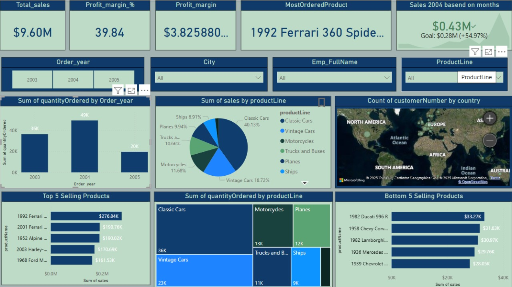

# Power BI Projects 🚀

## 📊 Sales Dashboard
This Power BI project analyzes sales data to track trends, revenue, and performance metrics.

### 🔹 Key Features:
- **Total Sales Analysis** 📈  
- **Regional Sales Breakdown** 🌍 
- **Customer Insights** 👥  
- **Product Performance** 🏆 

### 🖼️ Screenshot:

---

🔗 **Check my LinkedIn for more projects:**  
[Shaileja Karenolla](https://www.linkedin.com/in/shaileja-karenolla-1ba523289)  

## certificates
Certificates/Advanced Excel.jpg
